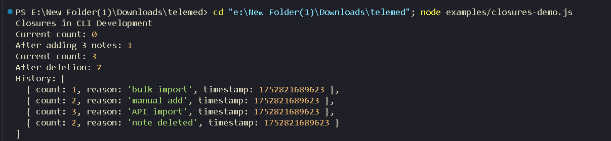
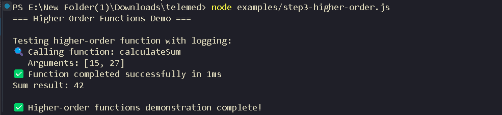
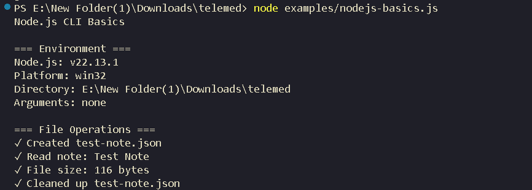
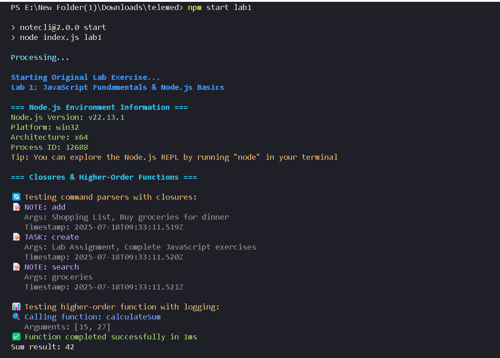
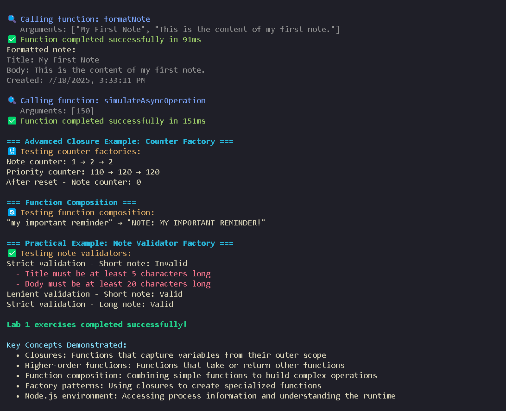

# Lab 1: JavaScript Fundamentals & Node.js Introduction

**📍 Navigation**: [← Main Guide](../EDUCATIONAL_GUIDE.md) | [Basics Theory](../EDUCATIONAL_GUIDE_BASICS.md) | [Next: Lab 2 →](./LAB2.md)

**🎯 Lab Files**: `labs/fundamentals.js` | `labs/lab1.js`

> **📸 Note**: Screenshot placeholders have been added throughout this document. Replace these with actual screenshots of terminal outputs when running the code examples.

## Learning Objectives

### Core JavaScript Refresher
- **Functions**: Declarations, expressions, arrow functions, and scope
- **Closures**: Understanding lexical scoping and practical applications
- **Objects & Arrays**: Manipulation, destructuring, and methods
- **Higher-Order Functions**: Functions that take/return other functions

### Node.js Fundamentals
- **Runtime Environment**: What is Node.js and how it works
- **Execution Context**: Call stack, event loop, and hoisting
- **Architecture**: Event-driven, non-blocking I/O model
- **Framework Comparison**: Node.js vs other backend technologies

### Practical Tasks
- [✓] Set up Node.js development environment
- [✓] Write functions demonstrating closures and higher-order functions
- [✓] Create first Node.js script with console.log and basic operations
- [✓] Explore Node.js REPL

## Quick Start

```bash
# Run the complete fundamentals course
npm start lab1

# Or run directly
node labs/lab1.js

# For interactive learning with theory
node labs/fundamentals.js

# For step-by-step practice exercises (matches documentation examples exactly)
node examples/step1-functions.js
node examples/step2-closures.js
node examples/step3-higher-order.js
node examples/step4-nodejs.js

# For comprehensive examples with additional features
node examples/functions-demo.js
node examples/closures-demo.js
node examples/nodejs-basics.js
```

**💡 Tip**: Start with the theory in [EDUCATIONAL_GUIDE_BASICS.md](../EDUCATIONAL_GUIDE_BASICS.md), then return here for hands-on practice!

## Theoretical Foundation

### JavaScript Language Fundamentals

Before diving into the code examples, it's essential to understand the core concepts that make JavaScript unique and powerful for both browser and server-side development.

#### Memory Management and Execution Context

**Call Stack**: JavaScript uses a single call stack to manage function execution. When a function is called, it's added to the top of the stack. When it returns, it's removed.

**Heap**: Objects and complex data structures are stored in the heap, while primitive values are typically stored in the stack.

**Execution Context**: Every function call creates a new execution context containing:
- **Variable Environment**: Local variables and function parameters
- **Lexical Environment**: References to outer scope variables (closures)
- **this Binding**: The context object for the function

#### Scope and Lexical Environment

**Global Scope**: Variables accessible from anywhere in the program
**Function Scope**: Variables accessible only within the function where they're declared
**Block Scope**: Variables (let/const) accessible only within the block where they're declared
**Lexical Scoping**: Inner functions have access to variables in their outer scope

#### Event Loop and Asynchronous Operations

JavaScript is single-threaded but can handle asynchronous operations through:
- **Call Stack**: Synchronous function execution
- **Web APIs/Node APIs**: Handle async operations (timers, I/O, HTTP requests)
- **Callback Queue**: Holds completed async operations
- **Event Loop**: Moves completed callbacks from queue to call stack

### Node.js Architecture Deep Dive

#### V8 Engine
Node.js uses Google's V8 JavaScript engine, which:
- Compiles JavaScript to optimized machine code
- Provides garbage collection
- Handles memory management
- Optimizes frequently used code paths

#### libuv Library
The core of Node.js's asynchronous capabilities:
- **Thread Pool**: Handles file I/O, DNS lookups, CPU-intensive tasks
- **Event Loop**: Manages callbacks and events
- **Platform Abstraction**: Provides cross-platform async I/O

#### Module System
Node.js supports two module systems:
- **CommonJS**: `require()` and `module.exports` (traditional)
- **ES Modules**: `import` and `export` (modern standard)
```
┌─────────────────────────────────────┐
│           Node.js Application       │
├─────────────────────────────────────┤
│           Node.js Bindings          │
├─────────────────────────────────────┤
│  V8 Engine  │       libuv           │
│ (JavaScript │   (Event Loop &       │
│  Execution) │   System Operations)  │
├─────────────┴───────────────────────┤
│        Operating System             │
└─────────────────────────────────────┘
```
## What You'll Learn

### 1. JavaScript Functions (3 Ways)

#### Theory: Understanding Function Types in JavaScript

JavaScript provides three primary ways to define functions, each with distinct characteristics that affect **hoisting**, **scope**, and **context binding**:

1. **Function Declarations** - Fully hoisted, can be called before definition
2. **Function Expressions** - Not hoisted, anonymous or named
3. **Arrow Functions** - Lexical `this` binding, concise syntax

#### Key Concepts:

- **Hoisting**: Function declarations are moved to the top of their scope during compilation
- **First-Class Functions**: Functions are values that can be assigned, passed, and returned
- **Lexical Scope**: Functions have access to variables in their outer scope
- **Context Binding**: How `this` is determined in different function types

#### Practical Implementation:

```javascript
// Function Declaration (hoisted) - CLI command handler
function handleAddCommand(title, content) {
  const note = createNote(title, content);
  return note;
}

function createNote(title, content) {
  return {
    id: Date.now(),
    title,
    content,
    created: new Date().toISOString()
  };
}

// Function Expression (not hoisted) - Data processor
const processNoteData = function(notes) {
  return notes.map(note => ({
    ...note,
    summary: note.content.substring(0, 50) + '...'
  }));
};

// Arrow Function (modern syntax) - Quick formatter
const displayNote = (note) => `[${note.id}] ${note.title}`;

// Test the functions
const newNote = handleAddCommand('Test Note', 'This is test content');
console.log(`Note "${newNote.title}" created with ID: ${newNote.id}`);
const processed = processNoteData([newNote]);
console.log(displayNote(processed[0]));
```

#### Code Explanation:

1. **`handleAddCommand()` & `createNote()`**: Function declarations that are hoisted, meaning they can be called anywhere in their scope
2. **`processNoteData`**: Function expression assigned to a variable - not hoisted, uses array `.map()` method with spread operator
3. **`displayNote`**: Arrow function with implicit return and template literal formatting
4. **Object Creation**: Using object literal syntax with computed properties and method shorthand

function-types-output.png


**Expected Output:**
```
Function Types in CLI Development
Note "Test Note" created with ID: 1752821683658
[1752821683658] Test Note
```

### 2. Closures in Action

#### Theory: Understanding Closures and Lexical Scoping

A **closure** is a fundamental JavaScript concept where an inner function has access to variables from its outer (enclosing) function's scope, even after the outer function has finished executing. This creates a persistent lexical environment.

#### Key Principles:

- **Lexical Scoping**: Variables are accessible based on where they're defined in the code structure
- **Persistent State**: Closures maintain access to outer variables even after the outer function returns
- **Data Encapsulation**: Private variables that can only be accessed through specific methods
- **Factory Pattern**: Functions that create and return other functions with shared state

#### Memory Management:
Closures keep references to their outer scope, which means variables won't be garbage collected until all closures referencing them are destroyed.

#### Practical Implementation:

```javascript
// Create a note counter with private state
function createNoteCounter() {
  let count = 0;
  let history = [];
  
  return {
    increment(reason = 'note added') {
      count++;
      history.push({ count, reason, timestamp: Date.now() });
      return count;
    },
    
    decrement(reason = 'note removed') {
      if (count > 0) {
        count--;
        history.push({ count, reason, timestamp: Date.now() });
      }
      return count;
    },
    
    getCurrent() {
      return count;
    },
    
    getHistory() {
      return [...history];
    },
    
    reset() {
      const oldCount = count;
      count = 0;
      history = [];
      console.log(`Counter reset from ${oldCount} to 0`);
    }
  };
}

// Test the counter
const counter = createNoteCounter();
console.log('Current count:', counter.getCurrent());
console.log('After adding 3 notes:', counter.increment('bulk import'));
counter.increment('manual add');
counter.increment('API import');
console.log('Current count:', counter.getCurrent());
counter.decrement('note deleted');
console.log('After deletion:', counter.getCurrent());
console.log('History:', counter.getHistory());
```

#### Code Explanation:

1. **`createNoteCounter()`**: Factory function that creates a closure with private `count` and `history` variables
2. **Private Variables**: `count` and `history` are not directly accessible from outside - only through returned methods
3. **Returned Object**: Contains methods that form closures, maintaining access to private variables
4. **State Persistence**: Each call to `createNoteCounter()` creates a new independent counter with its own state
5. **Array Spread**: `[...history]` returns a copy to prevent external modification of private data




**Expected Output:**
```
Closures in CLI Development
Current count: 0
After adding 3 notes: 1
Current count: 3
After deletion: 2
History: [
  { count: 1, reason: 'bulk import', timestamp: 1752821689623 },
  { count: 2, reason: 'manual add', timestamp: 1752821689623 },
  { count: 3, reason: 'API import', timestamp: 1752821689623 },
  { count: 2, reason: 'note deleted', timestamp: 1752821689623 }
]
```

### 3. Higher-Order Functions

#### Theory: Functions as First-Class Citizens

Higher-order functions are functions that either:
1. **Accept other functions as arguments** (callback pattern)
2. **Return functions as results** (function factory pattern)
3. **Both** (function composition and middleware patterns)

#### Key Concepts:

- **Callback Functions**: Functions passed as arguments to be executed later
- **Function Composition**: Building complex operations by combining simpler functions
- **Decorators/Wrappers**: Functions that enhance other functions with additional behavior
- **Currying**: Transforming functions with multiple arguments into a sequence of functions with single arguments

#### Use Cases in Development:
- **Middleware**: Express.js middleware functions
- **Event Handlers**: DOM event listeners
- **Data Processing**: Array methods like `.map()`, `.filter()`, `.reduce()`
- **Logging & Debugging**: Function wrappers for monitoring

#### Practical Implementation:

```javascript
// Higher-order function that wraps another function with logging
function withLogging(fn) {
  return function(...args) {
    const startTime = Date.now();
    console.log(`🔍 Calling function: ${fn.name || 'anonymous'}`);
    console.log(`   Arguments: [${args.map(arg => typeof arg === 'string' ? `"${arg}"` : arg).join(', ')}]`);
    
    try {
      const result = fn.apply(this, args);
      const endTime = Date.now();
      console.log(`✅ Function completed successfully in ${endTime - startTime}ms`);
      return result;
    } catch (error) {
      const endTime = Date.now();
      console.log(`Function failed after ${endTime - startTime}ms: ${error.message}`);
      throw error;
    }
  };
}

// Demo functions to wrap with logging
function calculateSum(a, b) {
  return a + b;
}

// Wrap and test the function
const loggedAdd = withLogging(calculateSum);
loggedAdd(15, 27); // Shows logging and returns 42
```

#### Code Explanation:

1. **`withLogging(fn)`**: Higher-order function that takes a function and returns an enhanced version
2. **Rest Parameters**: `...args` collects all arguments into an array for flexible argument handling
3. **Function.apply()**: Calls the original function with proper `this` context and argument array
4. **Error Handling**: Try-catch block ensures logging occurs even if the wrapped function fails
5. **Performance Monitoring**: Measures execution time using `Date.now()`
6. **Function Enhancement**: The returned function has all original functionality plus logging capabilities

*higher-order-functions-output.png*


**Expected Output:**
```
🔍 Calling function: calculateSum
   Arguments: [15, 27]
✅ Function completed successfully in 0ms
Sum result: 42
```

### 4. Node.js Environment

#### Theory: Understanding the Node.js Runtime

Node.js is a **JavaScript runtime** built on Chrome's V8 engine that enables server-side JavaScript execution. Unlike browser JavaScript, Node.js provides:

#### Core Architecture:

- **Event Loop**: Single-threaded event loop for handling I/O operations
- **Non-blocking I/O**: Asynchronous operations that don't block the main thread
- **CommonJS Modules**: Module system for organizing code (now also supports ES modules)
- **Global Objects**: `process`, `global`, `Buffer`, etc.

#### Key Differences from Browser:
- **No DOM**: No `window`, `document`, or DOM APIs
- **File System Access**: Can read/write files directly
- **Process Control**: Access to command-line arguments, environment variables
- **Module System**: Built-in module loading and caching

#### Event-Driven Architecture:
Node.js uses an event-driven, non-blocking I/O model that makes it lightweight and efficient for I/O-intensive applications.

#### Practical Implementation:

```javascript
console.log('Node.js CLI Basics');

// Environment Information
function showEnvironment() {
  console.log('\n=== Environment ===');
  console.log('Node.js:', process.version);
  console.log('Platform:', process.platform);
  console.log('Directory:', process.cwd());
  console.log('Arguments:', process.argv.slice(2).join(', ') || 'none');
}

// File operations demo
import fs from 'fs/promises';

async function demonstrateFileOps() {
  console.log('\n=== File Operations ===');
  
  const testFile = 'test-note.json';
  const noteData = {
    title: 'Test Note',
    content: 'This is a test note for the demo',
    created: new Date().toISOString()
  };
  
  try {
    // Write file
    await fs.writeFile(testFile, JSON.stringify(noteData, null, 2));
    console.log(`✓ Created ${testFile}`);
    
    // Read file
    const data = await fs.readFile(testFile, 'utf8');
    const parsed = JSON.parse(data);
    console.log(`✓ Read note: ${parsed.title}`);
    
    // File stats
    const stats = await fs.stat(testFile);
    console.log(`✓ File size: ${stats.size} bytes`);
    
    // Clean up
    await fs.unlink(testFile);
    console.log(`✓ Cleaned up ${testFile}`);
    
  } catch (error) {
    console.error('✗ File operation failed:', error.message);
  }
}

// Run demonstrations
showEnvironment();
await demonstrateFileOps();
```

#### Code Explanation:

1. **`process` Object**: Global object providing info about current Node.js process
   - `process.version`: Node.js version
   - `process.platform`: Operating system platform
   - `process.cwd()`: Current working directory
   - `process.argv`: Command-line arguments array

2. **ES Modules**: `import fs from 'fs/promises'` uses modern module syntax
3. **Promises API**: `fs/promises` provides promise-based file operations instead of callbacks
4. **Async/Await**: Modern asynchronous programming pattern for handling promises
5. **JSON Operations**: `JSON.stringify()` with formatting and `JSON.parse()` for data conversion
6. **File System Operations**:
   - `writeFile()`: Creates/writes file asynchronously
   - `readFile()`: Reads file content with encoding
   - `stat()`: Gets file metadata (size, permissions, dates)
   - `unlink()`: Deletes file (Unix terminology)

7. **Error Handling**: Try-catch block for handling file operation failures

*nodejs-environment-output.png*



**Expected Output:**
```
Node.js CLI Basics

=== Environment ===
Node.js: v22.13.1
Platform: win32
Directory: E:\New Folder(1)\Downloads\telemed
Arguments: none

=== File Operations ===
✓ Created test-note.json
✓ Read note: Test Note
✓ File size: 116 bytes
✓ Cleaned up test-note.json
```

## Expected Output

When you run `npm start lab1`, you should see:

**📸 Screenshot Placeholder:** *lab1-complete-output.png*
![Lab 1 Complete Output].
UU

```
Lab 1: JavaScript Fundamentals & Node.js Basics

=== Node.js Environment Information ===
Node.js Version: v22.13.1
Platform: win32
Architecture: x64
Process ID: 2964
Tip: You can explore the Node.js REPL by running "node" in your terminal

=== Closures & Higher-Order Functions ===
🔄 Testing command parsers with closures:
📝 NOTE: add
   Args: Shopping List, Buy groceries for dinner
   Timestamp: 2025-07-18T06:55:34.029Z
📝 TASK: create
   Args: Lab Assignment, Complete JavaScript exercises
   Timestamp: 2025-07-18T06:55:34.030Z
📝 NOTE: search
   Args: groceries
   Timestamp: 2025-07-18T06:55:34.031Z

📊 Testing higher-order function with logging:
🔍 Calling function: calculateSum
   Arguments: [15, 27]
✅ Function completed successfully in 0ms
Sum result: 42

🔍 Calling function: formatNote
   Arguments: ["My First Note", "This is the content of my first note."]
✅ Function completed successfully in 21ms
Formatted note:
Title: My First Note
Body: This is the content of my first note.
Created: 7/18/2025, 12:55:34 PM

🔍 Calling function: simulateAsyncOperation
   Arguments: [150]
✅ Function completed successfully in 151ms

=== Advanced Closure Example: Counter Factory ===
🔢 Testing counter factories:
Note counter: 1 → 2 → 2
Priority counter: 110 → 120 → 120
After reset - Note counter: 0

=== Function Composition ===
🔄 Testing function composition:
"my important reminder" → "NOTE: MY IMPORTANT REMINDER!"

=== Practical Example: Note Validator Factory ===
✅ Testing note validators:
Strict validation - Short note: Invalid
  - Title must be at least 5 characters long
  - Body must be at least 20 characters long
Lenient validation - Short note: Valid
Strict validation - Long note: Valid

Lab 1 exercises completed successfully!

Key Concepts Demonstrated:
  • Closures: Functions that capture variables from their outer scope
  • Higher-order functions: Functions that take or return other functions
  • Function composition: Combining simple functions to build complex operations
  • Factory patterns: Using closures to create specialized functions
  • Node.js environment: Accessing process information and understanding the runtime

Next Steps:
  • Try the note manager: npm start
  • Add some notes: npm start add "My Title" "My note content"
  • Explore the Node.js REPL: node
  • Read about closures: https://developer.mozilla.org/en-US/docs/Web/JavaScript/Closures

✅ Lab 1 execution complete!
Completed in 193ms
```

## Example File Outputs

### Running `node examples/functions-demo.js`

**📸 Screenshot Placeholder:** *functions-demo-terminal.png*


```
Function Types in CLI Development
Note "Test Note" created with ID: 1752821683658
[1752821683658] Test Note
```

### Running `node examples/closures-demo.js`

**📸 Screenshot Placeholder:** *closures-demo-terminal.png*


```
Closures in CLI Development
Current count: 0
After adding 3 notes: 1
Current count: 3
After deletion: 2
History: [
  { count: 1, reason: 'bulk import', timestamp: 1752821689623 },
  { count: 2, reason: 'manual add', timestamp: 1752821689623 },
  { count: 3, reason: 'API import', timestamp: 1752821689623 },
  { count: 2, reason: 'note deleted', timestamp: 1752821689623 }
]
```

### Running `node examples/nodejs-basics.js`

**📸 Screenshot Placeholder:** *nodejs-basics-terminal.png*


```
Node.js CLI Basics

=== Environment ===
Node.js: v22.13.1
Platform: win32
Directory: E:\New Folder(1)\Downloads\telemed
Arguments: none

=== File Operations ===
✓ Created test-note.json
✓ Read note: Test Note
✓ File size: 116 bytes
✓ Cleaned up test-note.json
```

## Key Concepts Explained

### Understanding JavaScript Fundamentals in Node.js Context

#### Function Types and Their Use Cases

**Function Declarations:**
```javascript
function myFunction() { } // Hoisted, can be called before definition
```
- **When to use**: Main application logic, utility functions, API handlers
- **Benefits**: Hoisting allows flexible code organization
- **Drawbacks**: Can lead to confusion about execution order

**Function Expressions:**
```javascript
const myFunction = function() { }; // Not hoisted, must be defined before use
```
- **When to use**: Event handlers, conditional function creation, as callbacks
- **Benefits**: Clear execution order, can be conditionally created
- **Drawbacks**: Cannot be called before definition

**Arrow Functions:**
```javascript
const myFunction = () => { }; // Lexical 'this', concise syntax
```
- **When to use**: Short utility functions, array methods, when lexical `this` is needed
- **Benefits**: Concise syntax, inherits `this` from enclosing scope
- **Drawbacks**: Cannot be used as constructors, no `arguments` object

### What is a Closure?

A closure is created when a function is defined inside another function, giving the inner function access to the outer function's variables even after the outer function has returned.

#### Real-World Analogy:
Think of a closure like a backpack. When a function is created inside another function, it "packs" references to variables from the outer scope into its "backpack." Even when the function travels to a different part of your program, it still has access to everything in its backpack.

#### Practical Benefits:
- **Data Privacy**: Create private variables that can't be accessed directly
- **State Persistence**: Maintain state between function calls
- **Factory Functions**: Create specialized functions with preset configurations
- **Module Pattern**: Organize code with public and private methods

### Why Use Higher-Order Functions?

Higher-order functions enable powerful programming patterns that make code more:
- **Reusable**: Write once, apply to many different functions
- **Composable**: Build complex operations from simple building blocks
- **Maintainable**: Separate concerns and reduce code duplication
- **Testable**: Easier to test individual components

#### Common Patterns:
- **Decorators**: Add functionality to existing functions (logging, caching, validation)
- **Middleware**: Process requests/responses in web applications
- **Event Handling**: React to user interactions or system events
- **Functional Programming**: Transform data through function chains

### Node.js vs Other Backend Technologies

#### Node.js Characteristics:
- **Single-threaded**: One main thread with event loop for I/O operations
- **Event-driven**: Responds to events (requests, file operations, timers)
- **Non-blocking I/O**: Operations don't stop the main thread
- **JavaScript**: Same language for frontend and backend

#### Comparison with Other Technologies:

**Node.js vs Python/Django:**
- Node.js: Faster for I/O-intensive operations, JavaScript ecosystem
- Python: Better for CPU-intensive tasks, extensive scientific libraries

**Node.js vs Java/Spring:**
- Node.js: Faster startup, lower memory usage, simpler deployment
- Java: Better for large enterprise applications, strong typing

**Node.js vs PHP:**
- Node.js: Better performance, modern language features, real-time capabilities
- PHP: Easier hosting, mature ecosystem for web development

#### When to Choose Node.js:
- **Real-time applications**: Chat apps, gaming, collaborative tools
- **API services**: RESTful APIs, microservices
- **I/O-intensive apps**: File processing, data streaming
- **Full-stack JavaScript**: Same language for frontend and backend

### Advanced JavaScript Patterns in Practice

#### The Module Pattern
Closures enable the module pattern, which provides:
```javascript
const MyModule = (function() {
  // Private variables
  let privateVar = 'secret';
  
  // Public API
  return {
    publicMethod() {
      return privateVar;
    }
  };
})();
```

#### Function Factories vs Classes
```javascript
// Factory Function (using closures)
function createUser(name) {
  return {
    getName: () => name,
    setName: (newName) => name = newName
  };
}

// Class (using prototypes)
class User {
  constructor(name) {
    this.name = name;
  }
  getName() { return this.name; }
}
```

#### Async Patterns Evolution
1. **Callbacks**: `fs.readFile(file, callback)`
2. **Promises**: `fs.promises.readFile(file).then()`
3. **Async/Await**: `await fs.promises.readFile(file)`

### Performance Considerations

#### Memory Usage
- Closures keep references to outer scope variables
- This can prevent garbage collection if not managed properly
- Use WeakMap/WeakSet for objects that should be garbage collected

#### Function Creation Costs
- Arrow functions vs regular functions have different creation costs
- Function declarations are hoisted, expressions are not
- Consider caching frequently created functions

#### Node.js Best Practices
- Use streams for large data processing
- Implement proper error handling
- Monitor event loop lag
- Use clustering for CPU-intensive tasks

## Next Steps

After completing Lab 1, you'll be ready for:
- **Lab 2**: Node.js Core Modules & File System Operations
- Building your first CLI application
- Understanding asynchronous programming patterns

## Troubleshooting

**Common Issues:**
- Module not found: Run `npm install`
- Permission errors: Check Node.js installation
- Syntax errors: Ensure Node.js version 18+

**Get Help:**
```bash
# Check Node.js version
node --version

# Test basic functionality
node -e "console.log('Node.js is working!')"

# Run step-by-step examples (aligned with documentation)
node examples/step1-functions.js
node examples/step2-closures.js  
node examples/step3-higher-order.js
node examples/step4-nodejs.js

# Run original comprehensive examples
node examples/functions-demo.js
node examples/closures-demo.js
node examples/nodejs-basics.js
```
